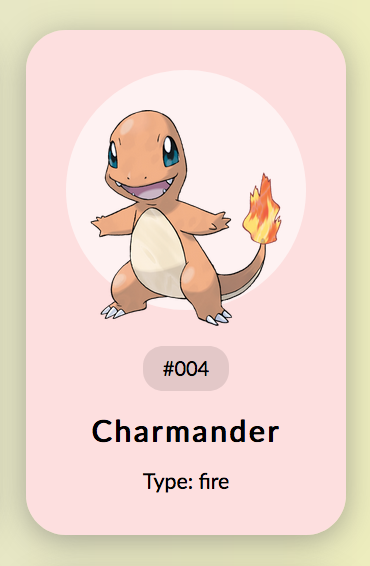

## Assignment 2: Router & Templating

## 1. Templating


In the `partials/pages/pokemon.hbs` file create a template that looks like the image above. You need to do the following things:

1. In `styles` create a `_pokemon.scss` and include it in the `main.scss` file at the top.
   1. Write the CSS for the card in the BEM syntax (similar to `_header.scss`)
   2. See: http://getbem.com/naming/
2. In `partials\pages\pokemon.hbs` add the classes from your `_pokemon.scss` and the needed HTML markup.
   1. In the `index.js` you will need to include the variables for `id` and `image` route `':type/:name'` and hand it over to the template (  `pokemonTemplate({ name: 'someName' })` )
   2. The data you need is inside `pokemon-data.js` and already included in `index.js`

## 2. Routing
1. Create 3 Routes `fire`, `water` and `grass` in the `index.js` file.
2. Create a new handlebars template for displaying the list of pokemon. To the template hand an array of pokemons of the specific type. `typeTemplate({ route: 'fire', pokemonList: pokemonData['fire'] })`
3. Inside the template you can iterate over the array of objects like so:

```handlebars
{{#each pokemonList }}
  <h2> {{ name }} </h2>
{{/each}}
```

4. The pokemon names in the list should once again link to the single pages of the pokemons.

```handlebars
<a href="#{{type}}/{{name}}"> {{name}} </a>
```

## 3. Navigation
Change the links in the main navigation in `partials\components\header.hbs` to only show the routes for the types `fire`, `water`, `grass`. Once you are on the page of a type like `fire`, you should be able to see all fire pokemon and go to its specific page.


## Libraries
### Handlebars
* Docs: https://handlebarsjs.com/
* or: https://handlebars-draft.knappi.org/guide/
* Webpack Loader: https://github.com/pcardune/handlebars-loader


### Router
Docs: https://github.com/krasimir/navigo

* **root**:  is the main URL of your application
* **useHash**: set to true then the router uses an old routing approach with hash in the URL. 
* **hash**: this parameter allows you to configure the hash character.

### BEM Syntax
* Official Docs: http://getbem.com/naming/
* Tutorial: https://css-tricks.com/bem-101/
* Examples: https://codepen.io/btflynn/full/RZwBBN